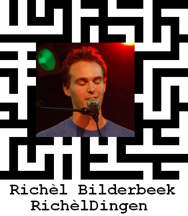

# CD #3: Richeldingen

Richel Bilderbeek's third CD, and his second solo album. 
It features a better -but still not perfect- recording as
well. The numbers are put on it alphabetically as the person who burned
the CD for me (a certain Tim Fawcett) did not care to arrange the music
in the order I suggested.

#|Title|Ogg|MP3
01|Al Heb Je Blauw Haar|[here](CD03_01AlHebJeBlauwHaar.ogg)|[here](CD03_01AlHebJeBlauwHaar.mp3)
02|Blauw|[here](CD03_02Blauw.ogg)|[here](CD03_02Blauw.mp3)
03|Come Home Darling|[here](CD03_03ComeHomeDarling.ogg)|[here](CD03_03ComeHomeDarling.mp3)
04|Concert Joost|[here](CD03_04ConcertJoost.ogg)|[here](CD03_04ConcertJoost.mp3)
05|De L.l|[here](CD03_05DeLul.ogg)|[here](CD03_05DeLul.mp3)
06|Het Koffielied|[here](CD03_06HetKoffielied.ogg)|[here](CD03_06HetKoffielied.mp3)
07|Het Leven Is Een Vuile ...........|[here](CD03_07HetLevenIsEenVuileKolerelijer.ogg)|[here](CD03_07HetLevenIsEenVuileKolerelijer.mp3)
08|Het Leven Is Naar|[here](CD03_08HetLevenIsNaar.ogg)|[here](CD03_08HetLevenIsNaar.mp3)
09|Het Mentorkindjeslied|[here](CD03_09HetMentorkindjeslied.ogg)|[here](CD03_09HetMentorkindjeslied.mp3)
10|Het N..kmenslied|[here](CD03_10HetNeukmenslied.ogg)|[here](CD03_10HetNeukmenslied.mp3)
11|Kinderliefde|[here](CD03_11Kinderliefde.ogg)|[here](CD03_11Kinderliefde.mp3)
12|Leontien|[here](CD03_12Leontien.ogg)|[here](CD03_12Leontien.mp3)
13|Mannen|[here](CD03_13Mannen.ogg)|[here](CD03_13Mannen.mp3)
14|Slaapliedje|[here](CD03_14Slaapliedje.ogg)|[here](CD03_14Slaapliedje.mp3)
15|Vroeger|[here](CD03_15Vroeger.ogg)|[here](CD03_15Vroeger.mp3)
16|Walsje|[here](CD03_16Walsje.ogg)|[here](CD03_16Walsje.mp3)
17|Wooloo Mooloo|[here](CD03_17WoolooMooloo.ogg)|[here](CD03_17WoolooMooloo.mp3)
